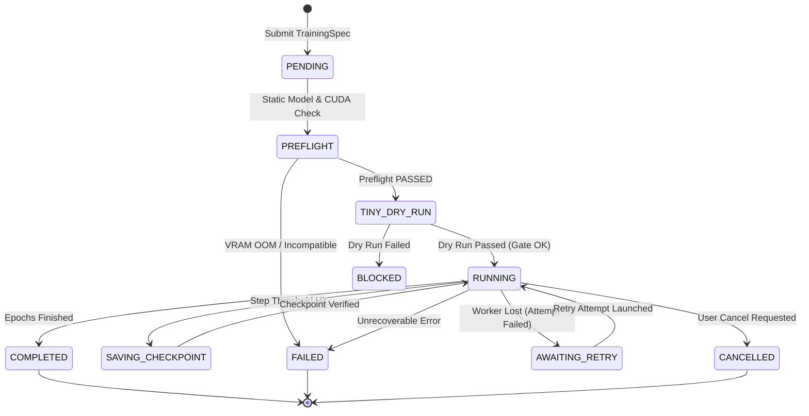
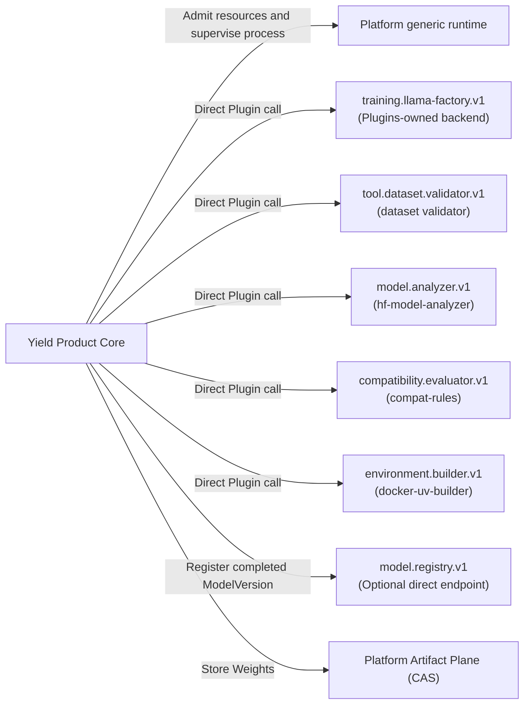
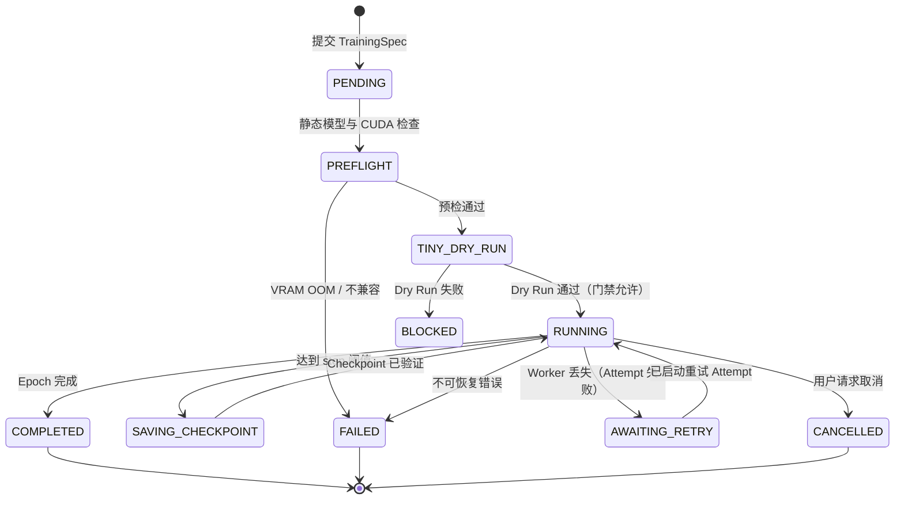
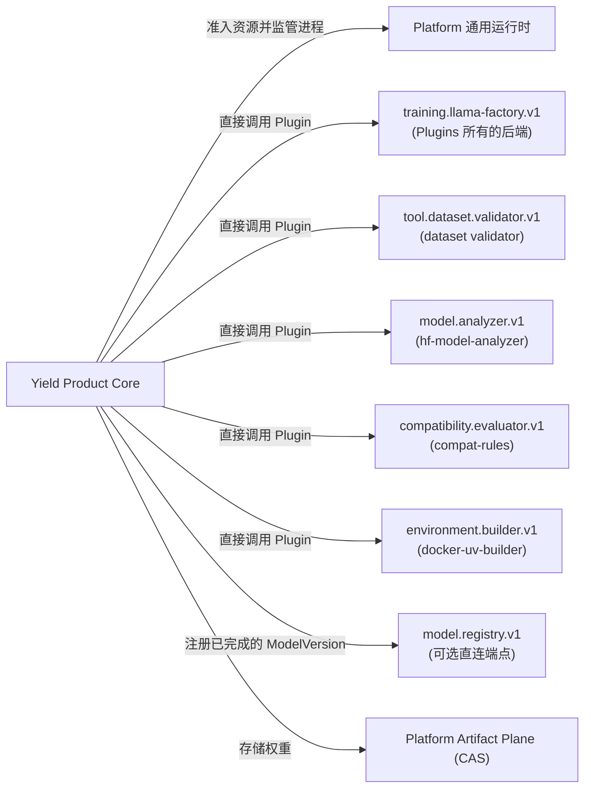

# Yield Product API & Training Contract Specification

This document provides the authoritative product specification and API contract for **Yield**, classified as **`ACTIVE_PRODUCT`** (Product 2), the Cyrene Model Training, Fine-Tuning, and Checkpoint Production Product.

---

## 1. Repository Role & Audience

- **Role**: `ACTIVE_PRODUCT` / Enterprise Model Training & Checkpoint Production Service.
- **Audience**: ML Engineers, Training Cluster Operators, Fine-Tuning Practitioners.
- **Implementation Status**: `IMPLEMENTED_WITH_LOCAL_EVIDENCE` (`TrainingRuntime`, `TrainingSpec`, `TinyDryRun`, `LlamaFactoryEngineAdapter`).

`IMPLEMENTED_WITH_LOCAL_EVIDENCE` means that the repository's local contract,
lint, type, and unit checks cover the listed paths. It does not mean that
hosted CI, a real CUDA deployment, model downloads, an upstream full-migration
acceptance, merge, or remote read-back has run for this document.

`IMPLEMENTED_WITH_LOCAL_EVIDENCE` 表示本仓库的本地契约、lint、类型与单元检查覆盖
上述路径；不表示 hosted CI、真实 CUDA 部署、模型下载、上游完整迁移验收、合并或
远程 read-back 已经运行。

---

## 2. What Yield Owns

Yield is the authoritative Product owner of:
- **Training Domain Objects**: `TrainingSpec`, `TrainingRun`, `TrainingAttempt`, `CheckpointRef`, `TinyDryRunResult`.
- **Training Lifecycle State Machine**: Preflight verification $\rightarrow$ Tiny Dry Run gate $\rightarrow$ workload staging $\rightarrow$ distributed training execution $\rightarrow$ checkpoint production.
- **Checkpoint Production Semantics**: Checkpoint validation, digest calculation, optimizer state stripping, model weight export.
- **Training Policies**: Learning rate schedules, LoRA/QLoRA hyperparameters, gradient accumulation, distributed backend configuration (DeepSpeed / FSDP2 / Megatron).

### What Must NOT Be Implemented in Yield
- **Dataset Ingestion & Raw Cleaning**: Owned by **Catalyst** (Yield consumes `DatasetRef`).
- **Model Deployment & Online Inference**: Owned by **Reactor**.
- **Model Evaluation & Benchmarking**: Owned by **Echo**.
- **Kernel Process Supervision & Hardware Authority**: Owned by **Platform Kernel & Node Agent**.

---

## 3. Public Product Objects & Data Contracts

```python
@dataclass(frozen=True)
class TrainingSpec:
    engine: EngineKind
    model: ModelRef
    dataset: DatasetRef
    output_dir: str
    hyperparameters: Dict[str, Any] = field(default_factory=dict)
    hardware_intent: Dict[str, Any] = field(default_factory=dict)
    environment_lock: Optional[EnvironmentLock] = None

@dataclass
class TrainingRun:
    run_id: str
    spec: TrainingSpec
    status: TrainingStatus
    created_at: datetime
    active_attempt_id: Optional[str] = None
    artifacts: List[ArtifactRef] = field(default_factory=list)
```

---

## 4. Training Lifecycle & State Transitions



---

## 5. Capability & Platform Consumption

### Durable orchestration and restart behavior

`TrainingControlPlane` stores the canonical `TrainingSpec` and resolved
`EnvironmentLock` with the Yield-owned `ProductRun`. Before creating a new
Attempt after restart, it reconstructs both values and verifies them against
the immutable `ExecutionPlan` intent and environment identity. Invalid,
missing, or altered recovery state fails closed before workload launch.

The current execution adapter keeps live process sessions in memory; it does
not adopt a previous process session after controller restart. If an
active execution reference cannot be observed, or an adapter returns a
different session identity, Yield requests cancellation and leaves the Plan
and Attempt in `CANCELLING` with `cleanup_confirmed=false`. Automatic retry is
quarantined until the execution provider positively confirms cleanup.

Produced outputs are Platform `ArtifactRef` values persisted on the real
training Attempt. Call `TrainingControlPlane.output_artifacts(run_id)` to read
those references after process or controller restart; local output paths are
not treated as durable Product results.



When `--model-registry-connection-ref` is configured, a completed result calls
`model.registry.v1/register` with type URL
`type.cyrene.io/model.registry.v1.register.request`. The payload contains the
validated immutable `model_version` and the Yield-owned `source_ref`; it never
contains model bytes or local paths. The response type URL is
`type.cyrene.io/model.registry.v1.register.response` and must acknowledge the
same `model_version_id`, an opaque `resource_uri`, a positive
`resource_version`, and a boolean `created` value. Yield rejects mismatched or
malformed acknowledgements and retries later; successful acknowledgements are
recorded as durable idempotency receipts.

- **Yield lifecycle**:
  - `cy_exec.training.lifecycle`: Yield-owned run, attempt, plan, and reconciliation state.
- **Platform primitives consumed**:
  - `cy_artifacts`: `LocalArtifactProvider`, `ArtifactRef`, and the open `ArtifactKind` value type.
  - `cyrene_preflight`: resource-fact and replaceable preflight contracts, including `HardwareFacts`.
- **Yield-owned contracts and policy**:
  - `cyrene_yield_contracts`: immutable `ModelVersion` composition and lineage identity.
  - `cy_exec.training.environment`: `EnvironmentResolver`, `EnvironmentLock`, and training environment selection.

---

## 6. Implementation Status Matrix

| Subsystem / Interface | Implementation Status | Notes |
|---|---|---|
| Training Spec & Runtime | `IMPLEMENTED_WITH_LOCAL_EVIDENCE` | `training/core/src/cy_exec/training/runtime.py`; local contract and unit evidence only. |
| Product Control Plane Adapter | `IMPLEMENTED_ALPHA` | Durable Product intent and ArtifactRef readback; reference-runtime restart is fail-closed and does not adopt live sessions. |
| Tiny Dry Run & Preflight | `IMPLEMENTED_WITH_LOCAL_EVIDENCE` | Pre-training gate covered by local checks; real CUDA behavior is not claimed. |
| Checkpoint Manager | `IMPLEMENTED_WITH_LOCAL_EVIDENCE` | Digest calculation and Artifact Plane publishing covered locally; hosted/remote acceptance is not claimed. |
| LLaMA-Factory Product Adapter | `IMPLEMENTED_LOCAL_ENDPOINT` | Direct `training.llama-factory.v1` adapter; concrete trainer is Plugins-owned. |
| Dataset Validation Product Adapter | `IMPLEMENTED_LOCAL_ENDPOINT` | Direct `tool.dataset.validator.v1` adapter; parsing/schema/quality algorithms are Plugins-owned. |
| Native Transformers Adapter | `REMOVED` | No in-tree concrete trainer or compatibility fallback. |
| Guided WebUI | `PLUGINS_OWNED` | Shipped with the LLaMA Factory Plugin, not the Yield Product package. |
| Model Registry Publishing | `IMPLEMENTED_OPTIONAL_ENDPOINT` | Strict `model.registry.v1` direct adapter with content-identity validation and durable idempotency receipts; a concrete registry remains Plugins-owned. |
---

<!-- Chinese Translation / 中文翻译 -->

# Yield Product API 与训练契约规范

本文档是 **Yield** 的权威 Product 规范与 API 契约。Yield 被归类为 **ACTIVE_PRODUCT**（Product 2），即 Cyrene 模型训练、微调与 checkpoint 生产 Product。

---

## 1. 仓库角色与读者

- **角色**：ACTIVE_PRODUCT / 企业模型训练与 checkpoint 生产服务。
- **读者**：机器学习工程师、训练集群运营人员、微调实践者。
- **实现状态**：IMPLEMENTED_WITH_LOCAL_EVIDENCE（TrainingRuntime、TrainingSpec、TinyDryRun、LlamaFactoryEngineAdapter）。

IMPLEMENTED_WITH_LOCAL_EVIDENCE 表示本仓库的本地契约、lint、类型和单元检查覆盖了所列路径。它不表示本文件记录的托管 CI、真实 CUDA 部署、模型下载、上游完整迁移验收、合并或远程 read-back 已经执行。

---

## 2. Yield 拥有什么

Yield 是以下内容的权威 Product 所有者：

- **训练领域对象**：TrainingSpec、TrainingRun、TrainingAttempt、CheckpointRef、TinyDryRunResult。
- **训练生命周期状态机**：预检验证 → Tiny Dry Run 门禁 → 工作负载暂存 → 分布式训练执行 → checkpoint 生成。
- **Checkpoint 生产语义**：checkpoint 验证、摘要计算、移除优化器状态、导出模型权重。
- **训练策略**：学习率计划、LoRA/QLoRA 超参数、梯度累积、分布式后端配置（DeepSpeed / FSDP2 / Megatron）。

### 不得在 Yield 中实现的内容

- **数据集接入与原始数据清理**：由 **Catalyst** 所有（Yield 消费 DatasetRef）。
- **模型部署与在线推理**：由 **Reactor** 所有。
- **模型评估与基准测试**：由 **Echo** 所有。
- **Kernel 进程监管与硬件权威**：由 **Platform Kernel 与 Node Agent** 所有。

---

## 3. Product 公共对象与数据契约

以下 Python 类型定义了 TrainingSpec 与 TrainingRun 的对象形状：

```python
@dataclass(frozen=True)
class TrainingSpec:
    engine: EngineKind
    model: ModelRef
    dataset: DatasetRef
    output_dir: str
    hyperparameters: Dict[str, Any] = field(default_factory=dict)
    hardware_intent: Dict[str, Any] = field(default_factory=dict)
    environment_lock: Optional[EnvironmentLock] = None

@dataclass
class TrainingRun:
    run_id: str
    spec: TrainingSpec
    status: TrainingStatus
    created_at: datetime
    active_attempt_id: Optional[str] = None
    artifacts: List[ArtifactRef] = field(default_factory=list)
```

---

## 4. 训练生命周期与状态迁移



---

## 5. 能力与 Platform 的使用

### 持久化编排与重启行为

TrainingControlPlane 将规范 TrainingSpec 和解析后的 EnvironmentLock 与 Yield 所有的 ProductRun 一同存储。重启后，在创建新 Attempt 前，它会重建这两个值，并与不可变 ExecutionPlan 意图和环境身份进行校验。恢复状态无效、缺失或被篡改时，会在启动工作负载前 fail closed。

当前执行适配器将活动进程会话保存在内存中；controller 重启后不会接管此前的进程会话。如果无法观察到活动执行引用，或适配器返回了不同的会话身份，Yield 会请求取消，并将 Plan 和 Attempt 保持在 CANCELLING 状态且 cleanup_confirmed=false。在执行提供方明确确认清理完成之前，自动重试会被隔离。

生成的输出是 Platform ArtifactRef 值，并持久化在真实训练 Attempt 上。进程或 controller 重启后，可调用 TrainingControlPlane.output_artifacts(run_id) 读取这些引用；本地输出路径不视为持久化 Product 结果。



配置 --model-registry-connection-ref 后，完成的结果会调用 model.registry.v1/register，类型 URL 为 type.cyrene.io/model.registry.v1.register.request。payload 包含经验证的不可变 model_version 和 Yield 所有的 source_ref；不会包含模型字节或本地路径。响应类型 URL 为 type.cyrene.io/model.registry.v1.register.response，必须确认相同的 model_version_id、一个不透明 resource_uri、正数 resource_version 和布尔值 created。Yield 会拒绝不匹配或格式错误的确认并稍后重试；成功确认会作为持久化幂等回执记录。

- **Yield 生命周期**：
  - cy_exec.training.lifecycle：Yield 所有的 run、attempt、plan 与 reconciliation 状态。
- **使用的 Platform 基元**：
  - cy_artifacts：LocalArtifactProvider、ArtifactRef，以及开放的 ArtifactKind 值类型。
  - cyrene_preflight：资源事实与可替换的预检契约，包括 HardwareFacts。
- **Yield 所有的契约与策略**：
  - cyrene_yield_contracts：不可变 ModelVersion 的组合与 lineage 身份。
  - cy_exec.training.environment：EnvironmentResolver、EnvironmentLock 与训练环境选择。

---

## 6. 实现状态矩阵

| 子系统 / 接口 | 实现状态 | 说明 |
|---|---|---|
| Training Spec 与 Runtime | IMPLEMENTED_WITH_LOCAL_EVIDENCE | training/core/src/cy_exec/training/runtime.py；仅有本地契约和单元证据。 |
| Product Control Plane Adapter | IMPLEMENTED_ALPHA | 持久化 Product 意图与 ArtifactRef 回读；reference-runtime 重启时 fail closed，不接管活动会话。 |
| Tiny Dry Run 与 Preflight | IMPLEMENTED_WITH_LOCAL_EVIDENCE | 训练前门禁由本地检查覆盖；不宣称真实 CUDA 行为。 |
| Checkpoint Manager | IMPLEMENTED_WITH_LOCAL_EVIDENCE | 摘要计算和发布到 Artifact Plane 有本地覆盖；不宣称 hosted/remote 验收。 |
| LLaMA-Factory Product Adapter | IMPLEMENTED_LOCAL_ENDPOINT | 直连 training.llama-factory.v1 适配器；具体 trainer 由 Plugins 所有。 |
| Dataset Validation Product Adapter | IMPLEMENTED_LOCAL_ENDPOINT | 直连 tool.dataset.validator.v1 适配器；解析、schema 与质量算法由 Plugins 所有。 |
| Native Transformers Adapter | REMOVED | 仓库内没有具体 trainer 或兼容回退实现。 |
| 引导式 WebUI | PLUGINS_OWNED | 随 LLaMA Factory Plugin 提供，不属于 Yield Product package。 |
| Model Registry 发布 | IMPLEMENTED_OPTIONAL_ENDPOINT | 严格的 model.registry.v1 直连适配器，具备内容身份校验和持久化幂等回执；具体 registry 由 Plugins 所有。 |
