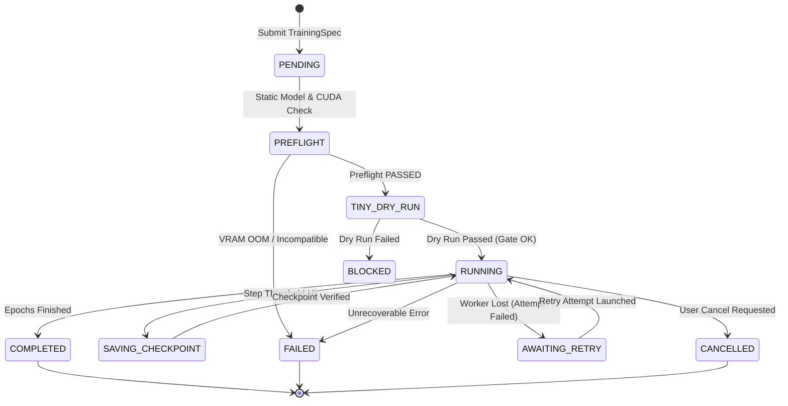
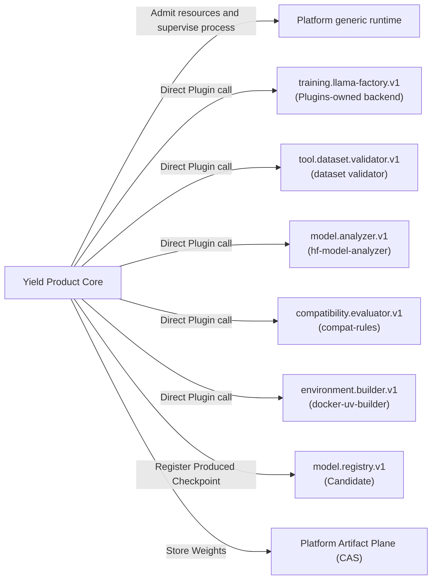

# Yield Product API & Training Contract Specification

This document provides the authoritative product specification and API contract for **Yield**, classified as **`ACTIVE_PRODUCT`** (Product 2), the Cyrene Model Training, Fine-Tuning, and Checkpoint Production Product.

---

## 1. Repository Role & Audience

- **Role**: `ACTIVE_PRODUCT` / Enterprise Model Training & Checkpoint Production Service.
- **Audience**: ML Engineers, Training Cluster Operators, Fine-Tuning Practitioners.
- **Implementation Status**: `IMPLEMENTED_WITH_LOCAL_EVIDENCE` (`TrainingRuntime`, `TrainingSpec`, `TinyDryRun`, `LlamaFactoryEngineAdapter`).

`IMPLEMENTED_WITH_LOCAL_EVIDENCE` means that the repository's local contract,
lint, type, and unit checks cover the listed paths. It does not mean that
hosted CI, a real CUDA deployment, model downloads, an upstream full-migration
acceptance, merge, or remote read-back has run for this document.

`IMPLEMENTED_WITH_LOCAL_EVIDENCE` 表示本仓库的本地契约、lint、类型与单元检查覆盖
上述路径；不表示 hosted CI、真实 CUDA 部署、模型下载、上游完整迁移验收、合并或
远程 read-back 已经运行。

---

## 2. What Yield Owns

Yield is the authoritative Product owner of:
- **Training Domain Objects**: `TrainingSpec`, `TrainingRun`, `TrainingAttempt`, `CheckpointRef`, `TinyDryRunResult`.
- **Training Lifecycle State Machine**: Preflight verification $\rightarrow$ Tiny Dry Run gate $\rightarrow$ workload staging $\rightarrow$ distributed training execution $\rightarrow$ checkpoint production.
- **Checkpoint Production Semantics**: Checkpoint validation, digest calculation, optimizer state stripping, model weight export.
- **Training Policies**: Learning rate schedules, LoRA/QLoRA hyperparameters, gradient accumulation, distributed backend configuration (DeepSpeed / FSDP2 / Megatron).

### What Must NOT Be Implemented in Yield
- **Dataset Ingestion & Raw Cleaning**: Owned by **Catalyst** (Yield consumes `DatasetRef`).
- **Model Deployment & Online Inference**: Owned by **Reactor**.
- **Model Evaluation & Benchmarking**: Owned by **Echo**.
- **Kernel Process Supervision & Hardware Authority**: Owned by **Platform Kernel & Node Agent**.

---

## 3. Public Product Objects & Data Contracts

```python
@dataclass(frozen=True)
class TrainingSpec:
    engine: EngineKind
    model: ModelRef
    dataset: DatasetRef
    output_dir: str
    hyperparameters: Dict[str, Any] = field(default_factory=dict)
    hardware_intent: Dict[str, Any] = field(default_factory=dict)
    environment_lock: Optional[EnvironmentLock] = None

@dataclass
class TrainingRun:
    run_id: str
    spec: TrainingSpec
    status: TrainingStatus
    created_at: datetime
    active_attempt_id: Optional[str] = None
    artifacts: List[ArtifactRef] = field(default_factory=list)
```

---

## 4. Training Lifecycle & State Transitions



---

## 5. Capability & Platform Consumption

### Durable orchestration and restart behavior

`TrainingControlPlane` stores the canonical `TrainingSpec` and resolved
`EnvironmentLock` with the Yield-owned `ProductRun`. Before creating a new
Attempt after restart, it reconstructs both values and verifies them against
the immutable `ExecutionPlan` intent and environment identity. Invalid,
missing, or altered recovery state fails closed before workload launch.

The current execution adapter keeps live process sessions in memory; it does
not adopt a previous process session after controller restart. If an
active execution reference cannot be observed, or an adapter returns a
different session identity, Yield requests cancellation and leaves the Plan
and Attempt in `CANCELLING` with `cleanup_confirmed=false`. Automatic retry is
quarantined until the execution provider positively confirms cleanup.

Produced outputs are Platform `ArtifactRef` values persisted on the real
training Attempt. Call `TrainingControlPlane.output_artifacts(run_id)` to read
those references after process or controller restart; local output paths are
not treated as durable Product results.



- **Yield lifecycle**:
  - `cy_exec.training.lifecycle`: Yield-owned run, attempt, plan, and reconciliation state.
- **Platform primitives consumed**:
  - `cy_artifacts`: `LocalArtifactProvider`, `ArtifactRef`, and the open `ArtifactKind` value type.
  - `cyrene_preflight`: resource-fact and replaceable preflight contracts, including `HardwareFacts`.
- **Yield-owned contracts and policy**:
  - `cyrene_yield_contracts`: immutable `ModelVersion` composition and lineage identity.
  - `cy_exec.training.environment`: `EnvironmentResolver`, `EnvironmentLock`, and training environment selection.

---

## 6. Implementation Status Matrix

| Subsystem / Interface | Implementation Status | Notes |
|---|---|---|
| Training Spec & Runtime | `IMPLEMENTED_WITH_LOCAL_EVIDENCE` | `training/core/src/cy_exec/training/runtime.py`; local contract and unit evidence only. |
| Product Control Plane Adapter | `IMPLEMENTED_ALPHA` | Durable Product intent and ArtifactRef readback; reference-runtime restart is fail-closed and does not adopt live sessions. |
| Tiny Dry Run & Preflight | `IMPLEMENTED_WITH_LOCAL_EVIDENCE` | Pre-training gate covered by local checks; real CUDA behavior is not claimed. |
| Checkpoint Manager | `IMPLEMENTED_WITH_LOCAL_EVIDENCE` | Digest calculation and Artifact Plane publishing covered locally; hosted/remote acceptance is not claimed. |
| LLaMA-Factory Product Adapter | `IMPLEMENTED_LOCAL_ENDPOINT` | Direct `training.llama-factory.v1` adapter; concrete trainer is Plugins-owned. |
| Dataset Validation Product Adapter | `IMPLEMENTED_LOCAL_ENDPOINT` | Direct `tool.dataset.validator.v1` adapter; parsing/schema/quality algorithms are Plugins-owned. |
| Native Transformers Adapter | `REMOVED` | No in-tree concrete trainer or compatibility fallback. |
| Guided WebUI | `PLUGINS_OWNED` | Shipped with the LLaMA Factory Plugin, not the Yield Product package. |
| Model Registry Publishing | `CONTRACT_CANDIDATE` | Slated for `model.registry.v1` integration. |
