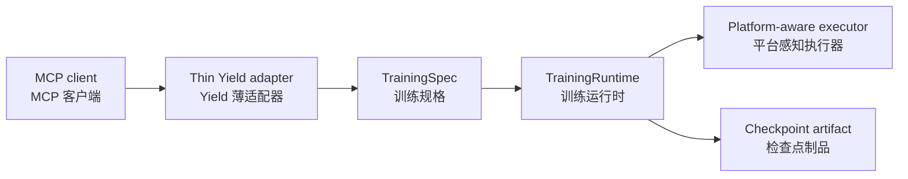
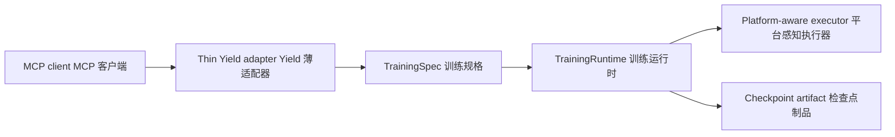

# MCP integration / MCP 集成

## Current posture / 当前状态

Yield's primary training interfaces are Python APIs, CLI, WebUI, and Platform execution contracts. There is no separate MCP training runtime boundary documented in the active product surface.

Yield 的主要训练接口是 Python API、CLI、WebUI 与 Platform 执行契约。当前产品活跃范围没有单独的 MCP 训练运行时边界。

## Intended adapter boundary / 预期适配边界

If an MCP adapter is added later, it should translate validated tool requests into `TrainingSpec` operations and return stable status/artifact views. It must not start an unmanaged process tree or bypass preflight, dry-run, approval, or cancellation policy.

如果未来增加 MCP 适配器，它应将经过校验的工具请求转换为 `TrainingSpec` 操作，并返回稳定的状态/制品视图。它不能启动不受管理的进程树，也不能绕过前置校验、试运行、审批或取消策略。

## Review checklist / 评审清单

- Validate model, dataset reference, output policy, resource intent, and timeout before dispatch.
- Reuse the normal training lifecycle and cancellation path.
- Keep protocol errors distinct from preflight, engine, executor, and checkpoint errors.
- Do not return credentials, raw local paths, or unmanaged process handles.

- 分发前校验模型、数据集引用、输出策略、资源意图与超时。
- 复用正常训练生命周期与取消路径。
- 将协议错误与前置校验、引擎、执行器、检查点错误分开。
- 不返回凭证、原始本地路径或不受管理的进程句柄。
---

<!-- Chinese Translation / 中文翻译 -->

# MCP 集成

## 当前状态

Yield 的主要训练接口是 Python API、CLI、WebUI 和 Platform 执行契约。当前活跃 Product 接口中没有单独的 MCP 训练 runtime 边界说明。

## 预期适配边界

如果以后增加 MCP 适配器，它应将经过验证的工具请求转换为 TrainingSpec 操作，并返回稳定的状态/制品视图。它不得启动不受管理的进程树，也不得绕过 preflight、dry-run、审批或取消策略。

## 评审清单

- 分发前验证模型、数据集引用、输出策略、资源意图和超时。
- 复用正常训练生命周期与取消路径。
- 将协议错误与 preflight、引擎、执行器及 checkpoint 错误区分开。
- 不返回凭证、原始本地路径或不受管理的进程句柄。
