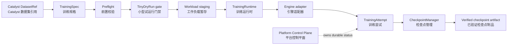

# Yield architecture overview / Yield 架构概览

## Role and boundary / 角色与边界

Yield converts a validated training specification into one or more controlled training attempts and verified checkpoint artifacts. It owns product intent and attempt status while delegating generic process supervision to Platform and concrete engine behavior to training engines.

Yield 将经过校验的训练规格转换为一个或多个受控训练尝试与已验证检查点制品。它负责产品意图与尝试状态，同时将通用进程监管委托给 Platform，将具体引擎行为委托给训练引擎。

## Training flow / 训练流程

The flow describes the product contract. A state diagram or adapter interface does not by itself prove that a workload can run on a particular environment.

该流程描述产品契约。状态图或适配器接口本身不能证明某个工作负载可以在特定环境中运行。

## Lifecycle states / 生命周期状态

| State | Meaning / 含义 | Gate / 门禁 |
|---|---|---|
| `PENDING` | Training intent is accepted / 训练意图已接受 | Submit a `TrainingSpec` / 提交 `TrainingSpec` |
| `PREFLIGHT` | Static model, data, hardware, and environment checks run / 执行模型、数据、硬件与环境静态检查 | Required facts are compatible / 所需事实兼容 |
| `TINY_DRY_RUN` | A minimal training step validates the path / 通过最小训练步骤验证路径 | Dry run passes / 试运行通过 |
| `RUNNING` | Engine executes the workload / 引擎执行工作负载 | Worker and attempt remain healthy / 工作器与尝试保持健康 |
| `SAVING_CHECKPOINT` | A checkpoint is written and verified / 正在写入并验证检查点 | Artifact digest and contents pass / 摘要与内容通过 |
| `AWAITING_RETRY` | Attempt failed but policy allows retry / 尝试失败但策略允许重试 | Retry is launched / 启动重试 |
| `COMPLETED` | Verified training artifacts are available / 已验证训练制品可用 | Terminal state / 终态 |
| `FAILED` / `BLOCKED` / `CANCELLED` | Training cannot continue, is gated, or was requested to stop / 无法继续、被门禁阻止或被请求停止 | Operator or policy action / 操作员或策略动作 |

## Ownership boundaries / 归属边界

- Yield owns `TrainingSpec`, `TrainingRun`, `TrainingAttempt`, checkpoint semantics, and training policy.
- Catalyst owns dataset ingestion and cleaning; Yield consumes a dataset reference.
- Reactor owns deployment and inference; Echo owns evaluation.
- Platform owns generic worker lifecycle, resource leases, and canonical hardware facts.
- Engine plugins own concrete LLaMA Factory or Transformers execution details.

- Yield 负责 `TrainingSpec`、`TrainingRun`、`TrainingAttempt`、检查点语义与训练策略。
- Catalyst 负责数据摄取与清洗；Yield 消费数据集引用。
- Reactor 负责部署与推理；Echo 负责评估。
- Platform 负责通用工作器生命周期、资源租约与标准硬件事实。
- 引擎插件负责具体的 LLaMA Factory 或 Transformers 执行细节。
