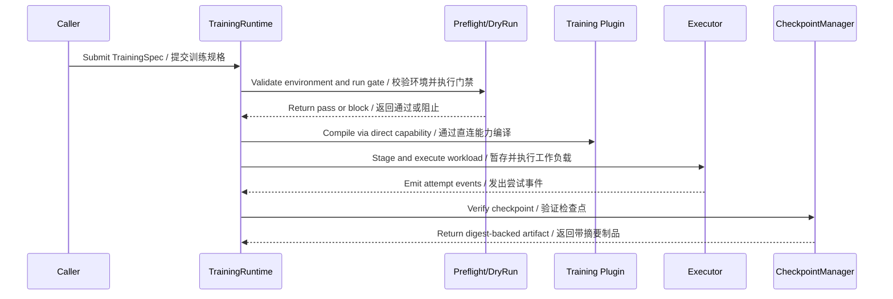

# Tool and capability system / 工具与能力系统

## Training capability seams / 训练能力接缝

Yield keeps product-level training intent separate from the engine and process mechanisms that execute it. The runtime compiles a validated spec, selects an adapter, stages a workload, and collects verified artifacts.

Yield 将产品层训练意图与执行训练的引擎和进程机制分离。运行时编译已校验规格、选择适配器、暂存工作负载并收集已验证制品。

| Surface | Responsibility / 职责 | Source area / 源码区域 |
|---|---|---|
| `TrainingSpec` and contracts | Stable intent, status, attempt, workload, and event types / 稳定的意图、状态、尝试、工作负载与事件类型 | `training/core/src/cy_exec/training/contracts/` |
| `TrainingRuntime` | Product attempt coordination and event handling / 产品尝试协调与事件处理 | `training/core/src/cy_exec/training/runtime.py` |
| Engine adapters | Map Product intent to Plugins-owned training capabilities / 将 Product 意图映射到 Plugins 所有的训练能力 | `training/core/src/cy_exec/training/engines/` |
| Executors | Start/stop local or kernel-bound process trees / 启停本地或内核管理的进程树 | `training/core/src/cy_exec/training/executors/` |
| Preflight and dry run | Gate incompatible or unsafe workloads / 拦截不兼容或不安全工作负载 | `training/core/src/cy_exec/training/preflight.py` |
| Checkpoint manager | Validate, digest, and publish checkpoint artifacts / 校验、计算摘要并发布检查点制品 | `training/core/src/cy_exec/training/checkpoint/` |
| LLaMA Factory backend | Provides the optional reusable engine capability and guided WebUI / 提供可选可复用引擎能力与引导式 WebUI | `../Cyrene-Plugins-Official/plugins/training/llama-factory/` via `training.llama-factory.v1` |
| Dataset validator | Parses staged files and reports schema/quality facts / 解析暂存文件并报告 schema/质量事实 | `../Cyrene-Plugins-Official/plugins/tools/dataset-validator/` via `tool.dataset.validator.v1` |

## Execution sequence / 执行时序

## Non-ownership rules / 非归属规则

- `TrainingRuntime` is the product attempt coordinator; an engine adapter must not become the durable status authority.
- Production kernel execution must use the canonical Platform contract; `InProcessKernelPort` is test-only.
- Training adapters must not silently ingest or clean raw datasets owned by Catalyst.
- Checkpoint publication must preserve digest and lineage information.
- LLaMA Factory and dataset parsing implementations must remain in Plugins; Yield keeps only Product ports and projections.

- `TrainingRuntime` 是产品尝试协调器；引擎适配器不能成为持久状态权威。
- 生产内核执行必须使用标准 Platform 契约；`InProcessKernelPort` 仅供测试。
- 训练适配器不能静默摄取或清洗属于 Catalyst 的原始数据集。
- 检查点发布必须保留摘要与血缘信息。
- LLaMA Factory 与数据集解析实现必须保留在 Plugins；Yield 只保留 Product 端口与映射。
